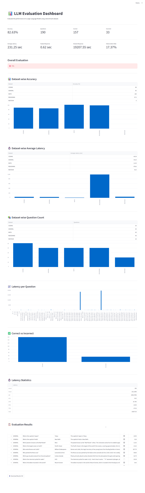
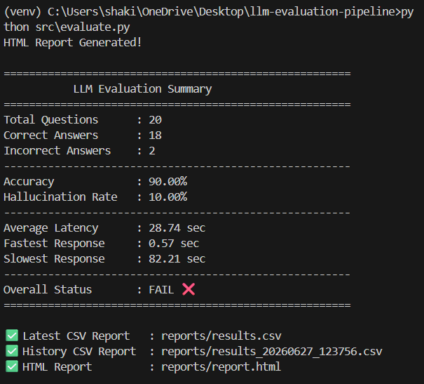

# 🚀 LLM Evaluation Pipeline

An automated **LLM Evaluation Pipeline** built with **Python**, **LM Studio**, and **Streamlit** to evaluate Large Language Models (LLMs) using a benchmark dataset. This project measures model performance, generates evaluation reports, and visualizes results through an interactive dashboard.

---

## 📌 Features

- 🤖 Connects to a local LLM using **LM Studio**
- 📚 Evaluates models using a custom benchmark dataset
- 📊 Calculates evaluation metrics:
  - Accuracy
  - Latency
- 📄 Saves evaluation results as a CSV report
- 📈 Interactive Streamlit dashboard
- 🛠️ Modular project structure
- 🔄 Ready for GitHub Actions (CI/CD)

---

## 🏗️ Project Structure

```text
llm-evaluation-pipeline/
│
├── .github/
│   └── workflows/
│       └── evaluate.yml
│
├── dashboard/
│   └── app.py
│
├── dataset/
│   └── golden_dataset.json
│
├── prompts/
│   └── system_prompt.txt
│
├── reports/
│   └── results.csv
│
├── src/
│   ├── llm.py
│   ├── evaluate.py
│   └── metrics.py
│
├── tests/
│
├── LICENSE
├── README.md
├── requirements.txt
├── .env
└── .gitignore
```

---

## ⚙️ Technologies Used

- Python
- LM Studio
- Llama 3.2
- OpenAI Python SDK
- Streamlit
- Pandas
- python-dotenv

---

## 📋 Prerequisites

Before running this project, ensure you have:

- Python 3.10+
- LM Studio installed
- A downloaded and loaded LLM (e.g., Llama 3.2)
- LM Studio Local Server running

Server URL:

```
http://127.0.0.1:1234
```

---

## 🔧 Installation

### Clone the repository

```bash
git clone https://github.com/shakilathasneem9/llm-evaluation-pipeline.git
cd llm-evaluation-pipeline
```

### Create a virtual environment

```bash
python -m venv venv
```

Activate it:

**Windows**

```bash
venv\Scripts\activate
```

### Install dependencies

```bash
pip install -r requirements.txt
```

---

## 🔑 Environment Variables

Create a `.env` file in the project root.

```env
OPENAI_BASE_URL=http://127.0.0.1:1234/v1
OPENAI_API_KEY=lm-studio
```

---

## 🚀 Running the Project

### Test the LLM Connection

```bash
python src/llm.py
```

---

### Run the Evaluation

```bash
python src/evaluate.py
```

Example Output

```text
Accuracy: 100%

Results saved to reports/results.csv
```

---

### Launch the Dashboard

```bash
streamlit run dashboard/app.py
## 📸 Visual Outputs

After running the pipeline, the system generates visual artifacts:

---

### 📊 Dashboard Snapshot

Live metrics visualization from Streamlit dashboard:



---

### 📄 Final Evaluation Report

Summary of evaluation results:


---

## 📊 Sample Dataset

```json
[
  {
    "question": "What is the capital of France?",
    "expected": "Paris"
  },
  {
    "question": "Who invented Python?",
    "expected": "Guido van Rossum"
  }
]
```

---

## 📈 Evaluation Metrics

The pipeline currently evaluates:

- ✅ Accuracy
- ✅ Response Latency
- ✅ Correct / Incorrect Responses

Future metrics:

- Hallucination Rate
- Faithfulness
- Cost Estimation
- Token Usage
- Model Comparison

---

## 📄 Output

The evaluation generates:

```
reports/results.csv
```

Example:

| Question | Expected | Actual | Correct | Latency |
|----------|----------|---------|---------|---------|
| What is the capital of France? | Paris | The capital of France is Paris. | ✅ | 14.94 |

---

## 🔮 Future Improvements

- GitHub Actions CI/CD
- HTML Evaluation Report
- Prompt Versioning
- Multiple Model Comparison
- Historical Evaluation Tracking
- Docker Support
- SQLite Database
- Advanced Dashboard Analytics

---

## 🤝 Contributing

Contributions are welcome!

1. Fork the repository
2. Create a feature branch
3. Commit your changes
4. Open a Pull Request

---

## 📜 License

This project is licensed under the MIT License.

---

## 👩‍💻 Author

**Shakila Thasneem**

GitHub:
https://github.com/shakilathasneem9

---

⭐ If you found this project useful, consider giving it a star on GitHub!